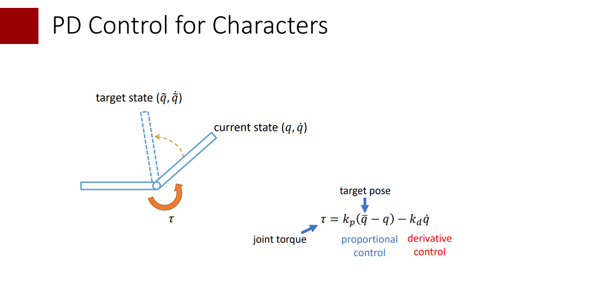
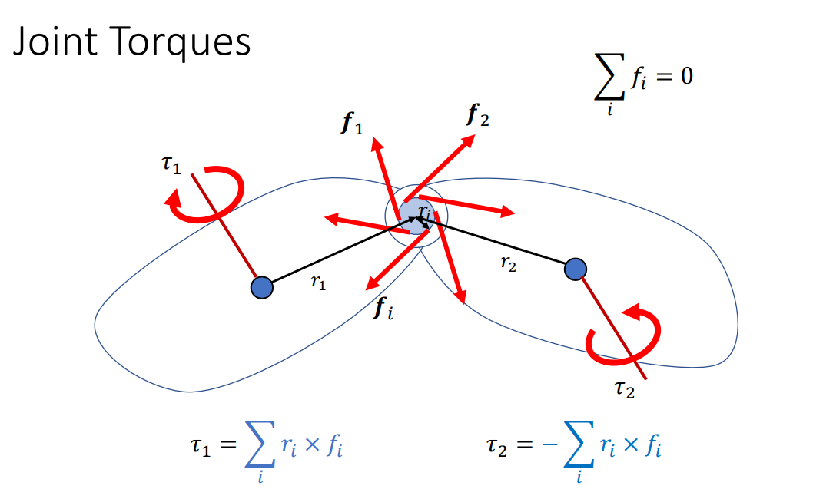
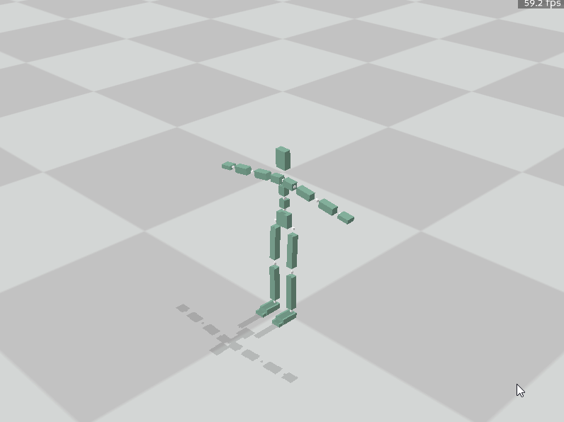
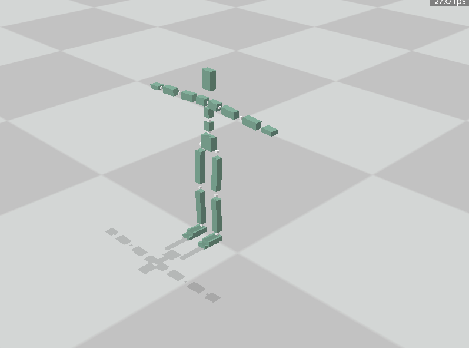
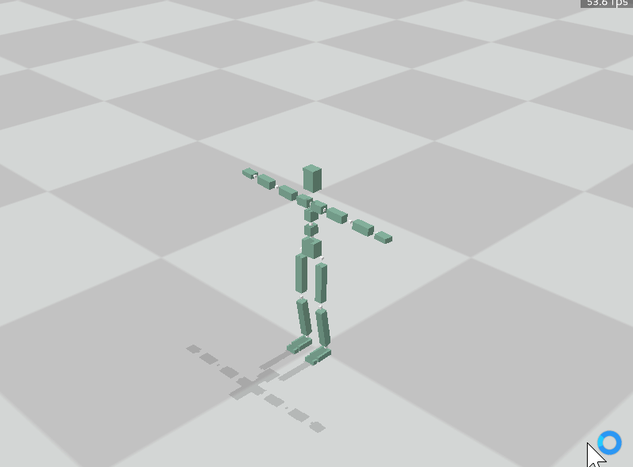
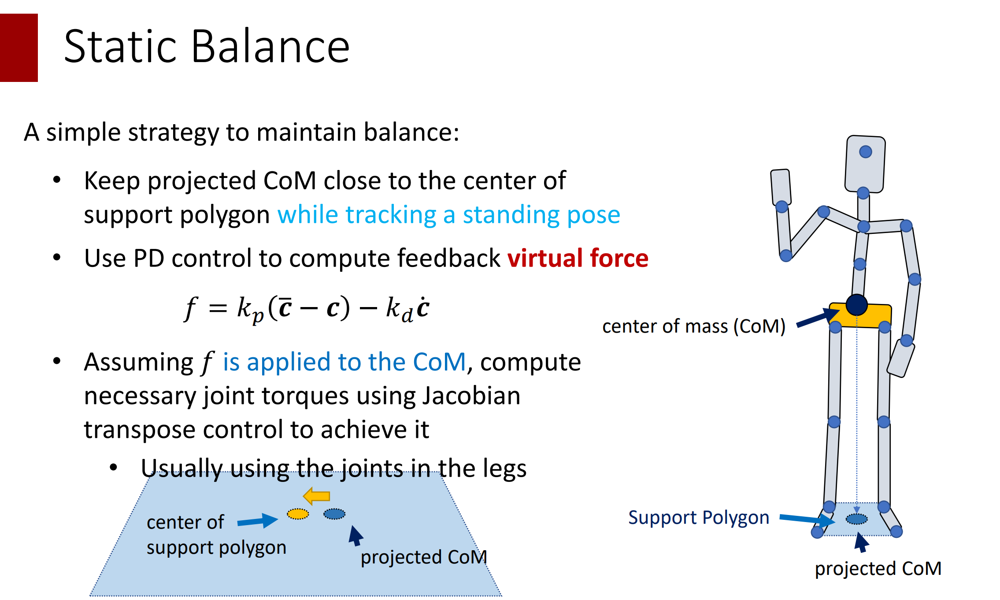
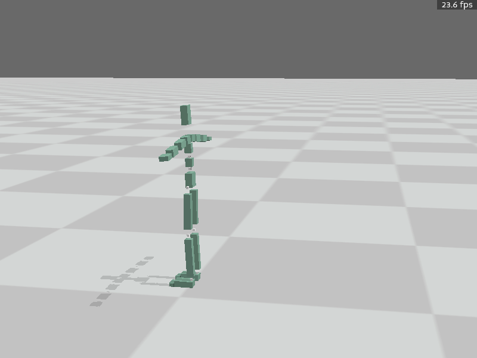
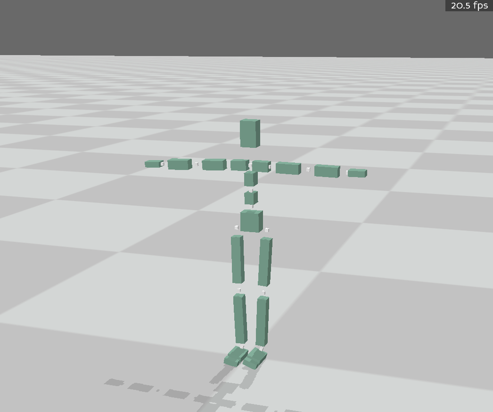

# 作业1

## 任务零  环境配置

### 1. 安装panda3d(Windows/Linux/Mac)
   
建议使用conda等建立新的虚拟环境
```bash
conda create -n games105 python=3.8
conda activate games105
conda install numpy scipy
pip install panda3d
```
如果下载过慢可使用清华镜像源安装 ( https://mirrors.tuna.tsinghua.edu.cn/help/anaconda/ )

> 本作业只允许使用 `numpy`， `scipy`，`pytorch`(`tensor-flow`, `jitter`)以及其依赖的库。评测时也以此为准。版本限定到2022年10月31日之前的发布版本。作业文件中请不要import除此之外的库。

完成后可以运行`task0_build_and_run.py`，你将会看到一个起始T-pose的角色，随着物理仿真他会跌倒在地上。

<p align=center>
 
</p>

## 任务一 站立控制

### part1 PD Control

为了能够在物理仿真环境中控制角色的运动，我们一般需要在角色的关节上施加力矩。一般来讲我们希望施加的力矩能够让关节呈现我们期望的角度。在本节我们实现简单的PD控制器来完成这一任务。

<p align=center>
 
</p>

这里你需要完成`part1_cal_torque`函数。其输入包含了一个`PhysicsInfo`对象，通过这个对象你可以获取当前的仿真状态如位置朝向速度角速度等。

> 物理中的关节一般没有朝向定义，此处朝向/角速度都是用子body的朝向/角速度代替

除此之外还会输入目标的pose和一个参数列表`kargs`，方便后续调用时更改指定的`kp, kd`，具体用法可以参考python语法教程如[Python 的 *args和 **kwargs](https://zhuanlan.zhihu.com/p/50804195)。

该函数返回在每个关节施加的关节力矩。对于每个关节，子link和父link将被施加大小相等方向相反的力矩，且`root`关节的力矩将会被无视掉。。

<p align=center>
 
</p>

注意返回的关节力矩的表示是在全局坐标下。强烈建议先在每个关节的父亲坐标系下计算pd力矩再转换为全局坐标下的。并且为了避免过大的力矩，建议对其进行一定的clip。

> 仿真细节： 正如课上讲的，稳定的PD控制需要非常小的仿真步长。故而Viewer的更新频率依然是60FPS，但是每次更新时会进行多步仿真，通过substep指定。默认substep=32，即仿真频率是1920FPS。每个substep执行之前都会根据当前仿真状态重新计算一次pd控制力矩并施加上去。

> PD控制的目标速度我们目前认为是0即可

在实现后可以获得一个维持T-pose的动作，由于没有控制根节点，有可能会摔倒。

<p align=center>
 
</p>

### part2: Hand of God

简单的PD控制很难让角色维持平衡。一些工作选择了在根节点上施加一个外力来辅助平衡。这会导致一定的不物理，但是确实能够帮助保持平衡。在本节你需要计算出这个外力的方向和大小，当然，还是使用PD控制。

你需要完成`part2_cal_float_base_torque`，其中额外输入了目标的根节点位置，你可以从`PhysicsInfo`中获取根节点当前的物理信息。函数返回在根节点施加的外力(世界坐标)和每个关节的力矩(世界坐标)。你可以调用part1的函数并通过kargs更改kp,kd。

完成后效果如下：

<p align=center>
 
</p>

以及可以大概track一个走路(注意此时根节点会被加上力矩)
<p align=center>
 
</p>

### part3: Static Balance

为了让角色运动符合真正的物理规律，我们实际上不能在根节点上施加外力。回忆课上讲的Jacobian Transpose方法可以通过在脚踝等关节上施加力矩来模拟这个外力的作用。

<p align=center>
 
</p>

在这一节你需要实现这样一个方法，计算出不需要外力就可以保持平衡的力矩。使得角色可以一直站立。

<p align=center>
 
</p>

如果你想的话也可以通过修改根节点目标位置的方式让他左右晃起来(

<p align=center>
 
</p>


## 任务二 走路控制器(Bonus)

在本次任务中，你需要实现一个真正的走路控制器。

你需要训练或优化一个策略，让其能够track一个走路的bvh（更复杂的当然也可以）

我们提供了一个physics_warpper，用来操作物理引擎。考虑到很多rl方法都需要大量的仿真采样，而带渲染的仿真采样速度较慢，
我们的physics_warpper中包含了一个不含渲染的仿真，其输入为一个torque_func(即`WalkingConroller.apply_torqe`的类似物，会在每个substep仿真前被调用)。

一些参考方法：

- 基于采样和优化的方法：[Learning Reduced-Order Feedback Policies for Motion Skills](https://libliu.info/)
- 基于强化学习的方法：[DeepMimic: Example-Guided Deep Reinforcement Learning of Physics-Based Character Skills](https://xbpeng.github.io/projects/DeepMimic/index.html)
- 基于模型的强化学习的方法：[SuperTrack – Motion Tracking for Physically Simulated Characters using Supervised Learning](https://montreal.ubisoft.com/en/supertrack-motion-tracking-for-physically-simulated-characters-using-supervised-learning/)


## 提交

需要提交的文件是`answer_task1.py`和`answer_task2.py`。

如有问题或Bug，可以在issue，QQ群和我们的[课程讨论版](https://github.com/GAMES-105/GAMES-105/discussions)内进行讨论。