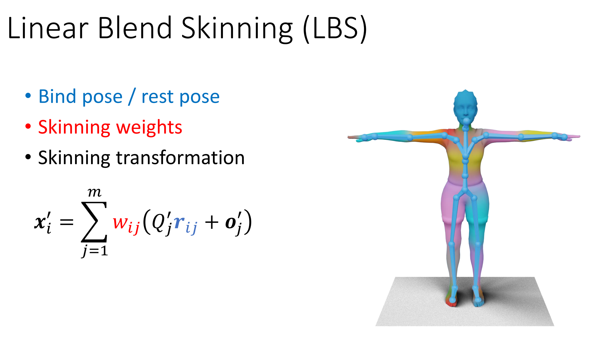
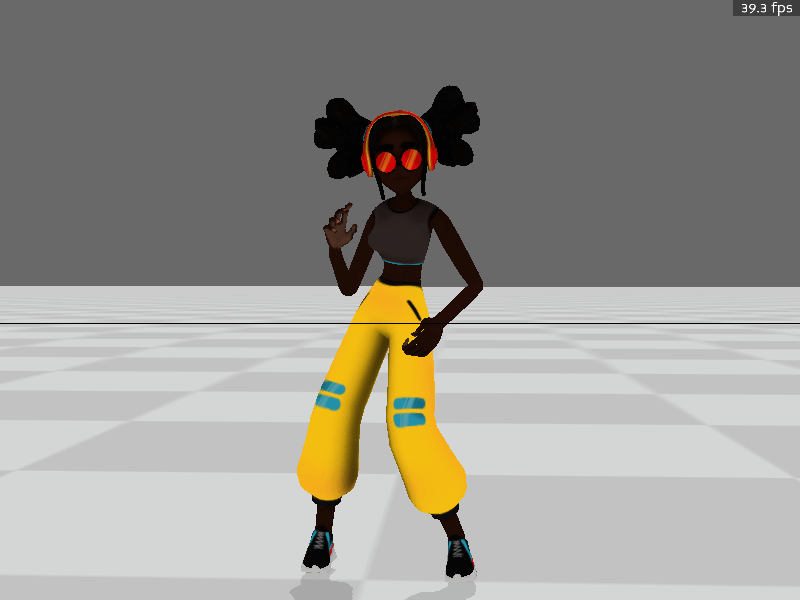

# 作业2.5

## 任务零  环境配置

### 1. 安装panda3d(Windows/Linux/Mac)
   
建议使用conda等建立新的虚拟环境
```bash
conda create -n games105 python=3.8
conda activate games105
conda install numpy scipy
pip install panda3d
```
如果下载过慢可使用清华镜像源安装 ( https://mirrors.tuna.tsinghua.edu.cn/help/anaconda/ )

> 本作业只允许使用 `numpy`， `scipy`，`pytorch`(`tensor-flow`, `jitter`)以及其依赖的库。评测时也以此为准。版本限定到2022年10月31日之前的发布版本。作业文件中请不要import除此之外的库。

并且需要到以下连接中下载`test.bam`放到`material`文件夹中。

```
https://disk.pku.edu.cn/link/AAF8EDBD6542AE4C02BD8A0909FE03FC5D
```

完成后可以运行`task0_build_and_run.py`，你将会看到一个带有蒙皮的T_pose人物

<p align=center>
 
</p>

## 任务: 简单蒙皮

这次我们的任务很简单：给出了骨骼动画和对应的蒙皮信息，让蒙皮跟随着骨骼动画运动吧！

我们给出了一个模型，以及与模型骨骼对应的bvh。模型本质上是一个Mesh，由一个个顶点连接成的三角面片组成。你的任务就是给出顶点跟随骨骼运动的函数`answer_task1.py\skinning`（下图是LBS原理）。

<p align=center>

</p>

这里为了方便，我们假设每个顶点最多被四个骨骼控制，我们给出了它受这四个骨骼影响的权重。

正确完成`skinning`函数后，你能在part1看到一个固定姿态，在part2看到一个跳舞的角色。

<p align=center>

</p>


## 提交

需要提交的文件是`answer_task1.py`。 

如有问题或Bug，可以在issue，QQ群和我们的[课程讨论版](https://github.com/GAMES-105/GAMES-105/discussions)内进行讨论。


## Q&A

- 目前已知可能的Bug有panda3d对模型的读入在不同的电脑上可能逻辑不一样，没有定位到产生区别的原因。
- 在几个助教电脑上测试的结果时`BAM`文件暂无问题。如果下载bam后无法运行可以考虑把`mesh_viewer.py`中对`test.bam`的读取改为`test.gltf`
